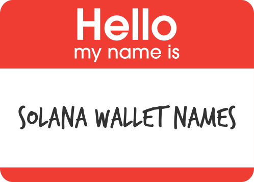

# Solana Wallet Names

[](https://github.com/portalpayments/solana-wallet-names/actions)




This package resolves wallet names to wallet addresses (and the reverse) across the entire Solana ecosystem, including **7 different name services** and **4 different profile picture (PFP) services**.

Supported **wallet names** are:

 - **.abc** (using Solana PFP standard for profile pictures)
 - **.backpack** (using Backpack for profile pictures)
 - **.bonk** (using Solana PFP standard for profile pictures)
 - **.glow** (using Glow for profile pictures)
 - **.poor** (using Solana PFP standard for profile pictures)
 - **.sol** (using Solana PFP standard for profile pictures)
 - **@twitter** (using Twitter standard for profile pictures)

## Note: wallet names do not assert identity

Wallet names are a convenient alternative for wallet addresses. However **wallet names do not assert identity**. The services used in this library do not check the real-world identity of people registering wallet names.
 - Many wallet names that sounds like real world people and organisations are not those organisation - `barclays.sol` isn't Barclays, `cashapp.sol` isn't cashapp, `joemccann.sol` isn't the well known Solana investor. This isn't just Solana, all blockchain name services and DNS itself operate this way. Having a particular name registered simply means the holder was the first person to register that name.
 - Wallet name services that include given and family names do not check that the person has identification matching the given and family names.
 - Profile picture services do not check that the person depicted matches the owner of the wallet

Ensure users are aware that wallet names do not assert identity:

> **Warning**
> There is no guarantee that (walletName) represents a particular individual or organisation.

Use the [Solana Verification]() (coming 🔜) library to assert individual or organisation identity and/or get profile pictures that are proven match the identity of the wallet holder. 

# Installation

```
npm i "@portal-payments/solana-wallet-names"
```

# Setup

All you need is a Solana `Connection` object. Optionally, you can also get a [Twitter bearer token](https://developer.twitter.com/en/docs/authentication/oauth-2-0/bearer-tokens) - not including `twitterBearerToken` will simply disable Twitter results.

## Wallet name ➡️ wallet address (and profile picture)

If you have a wallet name, like `mikemaccana.abc`, and you want to get an address and profile picture:

```typescript
import { walletNameToAddressAndProfilePicture } from "@portal-payments/solana-wallet-names";

const walletAddressAndProfilePicture = await walletNameToAddressAndProfilePicture(
  // A Solana connection
  connection,
  // One of: .abc .backpack .bonk .glow .poor .sol or @twitter
  "mikemaccana.abc"
);
```

`walletAddressAndProfilePicture` will look like:

```
{
  walletAddress: "5FHwkrdxntdK24hgQU8qgBjn35Y1zwhz1GZwCkP2UJnM",
  profilePicture: https://some.url/filename.ext,
}
```

## Wallet address ➡️ wallet name (and profile picture)

If you have a wallet address, like `5FHwkrdxntdK24hgQU8qgBjn35Y1zwhz1GZwCkP2UJnM`, and you want to get an address and profile picture:

```typescript
import { walletAddressToNameAndProfilePicture } from "@portal-payments/solana-wallet-names";

const nameAndProfilePicture = await walletAddressToNameAndProfilePicture(
  // A Solana connection
  connection,
  // A Solana wallet address
  walletAddress
);
```

`nameAndProfilePicture` will look like:

```
{
  walletName: "mikemaccana.sol",
  profilePicture: https://some.url/filename.ext,
}
```

## Limits

- In cases where addresses can have multiple account names, only the first or 'main' account name is returned.
- Twitter to address lookup is handled through Bonfida `.sol` domains. Very few people with `.sol` domains have set up Twitter handle to `.sol` domain handling. If you do own a `.sol` domain it [setting up Twitter to .sol mapping](https://docs.bonfida.org/collection/solana-name-service-twitter) takes less than five minutes.
- Solana PFP Standard uses the Netscape 'broken image' icon for missing images. This is ugly, so instead we return `null`.
- Backpack's wallet to name mapping seems to be in beta. It currently doesn't return results for some wallets. This endpoint also requires a Backpack JWT (unlike the name to wallet mappings, which are publicly available) so I susoect this service is still in beta.
